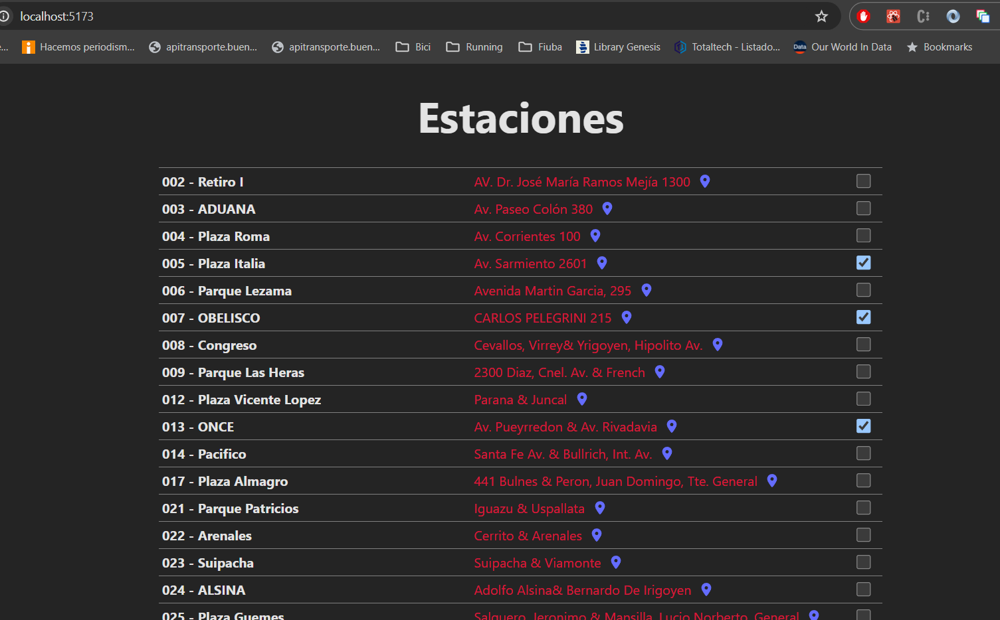

# Bici Cac

- Copiar el archivo `.env` a `env.local`
- Agregar las keys en el archivo `env.local`
- `npm install`
- `npm run dev`

---

### Por ahora tiene una sola página que consulta a la api de CABA y muestra el listado de Estaciones.

---

Los ids de las Estaciones Seleccionadas están hardcodeados en un json. Debería consultarlo/modificarlo en el backend según el usuario logeado.

---

Para evitar el error de CORS, en modo development, el acceso a la api se hace mediante un PROXY configurado en `vite.config.js`

En producción se debería deployar un server que haga de gateway a la api.

