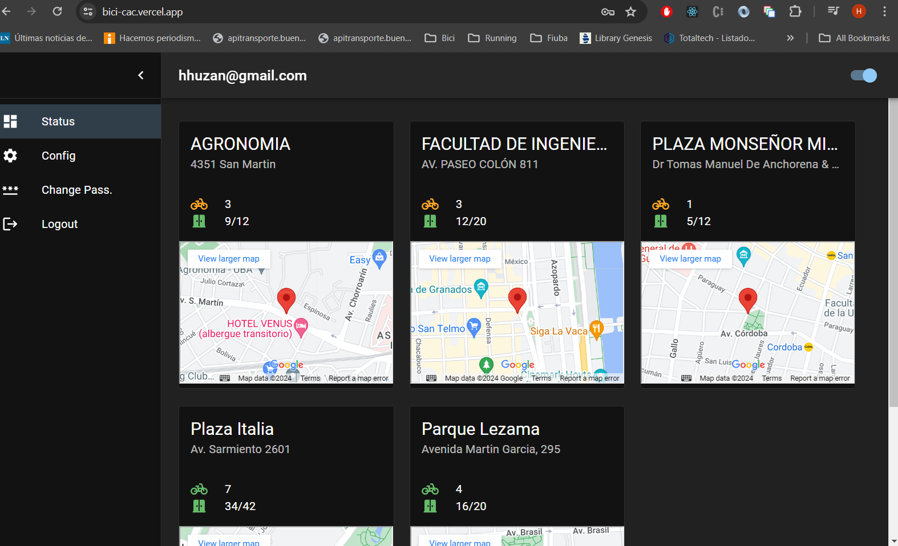

# Bici Cac

-   Copiar el archivo `.env` a `env.local`
-   Agregar las keys en el archivo `env.local`
-   `npm install`
-   `npm run dev`

---

El cambio de modo Dark/Default se hace en `App.jsx` (`darkMode = true`)

---

Para evitar el error de CORS, en modo development, el acceso a la api se hace mediante un PROXY configurado en `vite.config.js`

En producción se debería deployar un server que haga de gateway a la api.

---

